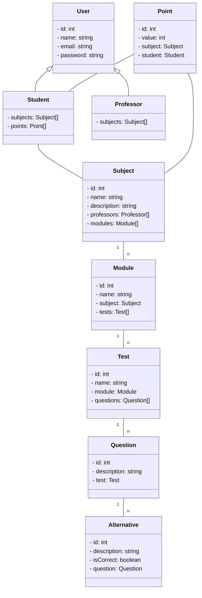

# Application Modeling

## Entities
O sistema modela uma aplicação educacional com as seguintes entidades e seus relacionamentos:

- **Usuário**: Representa uma pessoa que pode ser um estudante ou um professor. Cada usuário tem um `id`, `nome`, `email` e `senha`.

- **Estudante**: É um tipo de usuário que estuda várias disciplinas e acumula pontos. Cada estudante tem uma lista de `disciplinas` e `pontos`.

- **Professor**: É um tipo de usuário que ensina várias disciplinas. Cada professor tem uma lista de `disciplinas` que ensina.

- **Disciplina**: Representa uma matéria que pode ser ensinada por vários professores e contém vários módulos. Cada disciplina tem um `id`, `nome`, `descrição`, uma lista de `professores` e uma lista de `módulos`.

- **Ponto**: Representa a pontuação que um estudante recebe em uma disciplina. Cada ponto tem um `id`, `valor`, e está associado a uma `disciplina` e a um `estudante`.

- **Módulo**: É uma parte de uma disciplina que contém vários testes. Cada módulo tem um `id`, `nome`, está associado a uma `disciplina` e contém uma lista de `testes`.

- **Teste**: É uma avaliação em um módulo que contém várias questões. Cada teste tem um `id`, `nome`, está associado a um `módulo` e contém uma lista de `questões`.

- **Questão**: É uma pergunta em um teste que pode ter várias alternativas. Cada questão tem um `id`, `descrição`, e está associada a um `teste`.

- **Alternativa**: É uma possível resposta para uma questão, que pode ser correta ou não. Cada alternativa tem um `id`, `descrição`, um indicador se é correta (`isCorrect`), e está associada a uma `questão`.

Os relacionamentos entre essas entidades são:

- Um **usuário** pode ser um **estudante** ou um **professor**.
- Um **estudante** estuda várias **disciplinas**.
- Uma **disciplina** pode ser ensinada por vários **professores** e contém vários **módulos**.
- Um **módulo** contém vários **testes**.
- Um **teste** contém várias **questões**.
- Uma **questão** tem várias **alternativas**.
- Um **ponto** está associado a um **estudante** e a uma **disciplina**.

