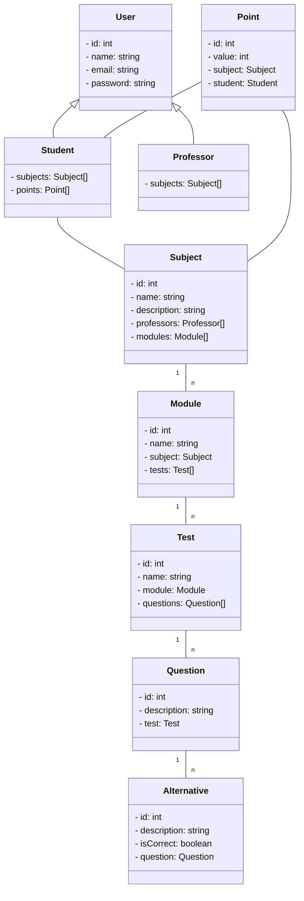

# Application Modeling

## Entities

```mermaid
classDiagram
    class User {
        - id: int
        - name: string
        - email: string
        - password: string
    }
    class Student {
        - subjects: Subject[]
        - points: Point[]
    }
    class Professor {
        - subjects: Subject[]
    }
    class Subject {
        - id: int
        - name: string
        - description: string
        - professors: Professor[]
        - modules: Module[]
    }
    class Point {
        - id: int
        - value: int
        - subject: Subject
        - student: Student
    }
    class Module {
        - id: int
        - name: string
        - subject: Subject
        - tests: Test[]
    }
    class Test {
        - id: int
        - name: string
        - module: Module
        - questions: Question[]
    }
    class Question {
        - id: int
        - description: string
        - test: Test
    }
    class Alternative {
        - id: int
        - description: string
        - isCorrect: boolean
        - question: Question
    }

    User <|-- Student
    User <|-- Professor
    Student -- Subject
    Subject "1" -- "n" Module
    Module "1" -- "n" Test
    Test "1" -- "n" Question
    Question "1" -- "n" Alternative
    Point -- Student
    Point -- Subject
```
